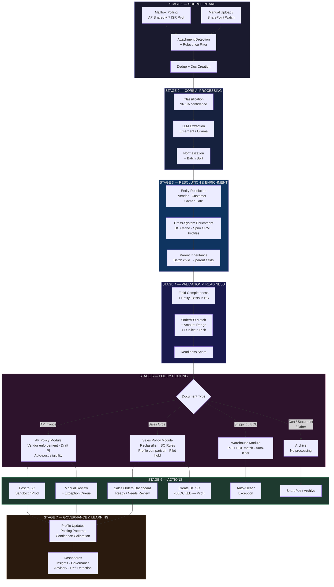

# GPI Document Hub — Unified Platform Architecture
## v2.1.0 | 2026-04-16 | Canonical Pipeline Model

---

## 1. Architecture Summary

GPI Document Hub is a **single document intelligence platform** with a shared processing backbone. AP Invoices and Sales Orders are not separate systems — they are **policy specializations** applied at stage 5 of a 7-stage canonical pipeline. Every document, regardless of type, enters through the same intake, classification, extraction, and resolution layers. Divergence occurs only where business rules genuinely differ.

The prior representation drew AP and Sales as two mostly-independent end-to-end flows, duplicating intake → extraction → normalization → resolution across both. This was architecturally misleading. In the codebase, these stages share the same function (`_internal_intake_document`), the same LLM extraction pipeline, and the same normalization logic. The branching happens at one point: the `doc_type` switch after normalization completes.

---

## 2. Canonical Pipeline — 7 Stages

```
┌──────────────────────────────────────────────────────────────┐
│  STAGE 1: SOURCE INTAKE                                      │
│  ─────────────────────                                       │
│  • MS Graph API mailbox polling (AP shared + 7 ISR pilot)    │
│  • Manual upload / SharePoint watch                          │
│  • Attachment detection                                      │
│  • Relevance filtering (signatures, images, disclaimers)     │
│  • Deduplication (SHA-256 + internet_message_id)             │
│  • Document record creation in hub_documents                 │
└──────────────────────────┬───────────────────────────────────┘
                           │
┌──────────────────────────▼───────────────────────────────────┐
│  STAGE 2: CORE AI PROCESSING                                 │
│  ────────────────────────                                    │
│  • Document classification (LLM, 96.1% avg confidence)       │
│  • Multi-page batch detection + auto-split                   │
│  • Field extraction (Emergent/Ollama LLM abstraction)        │
│  • Field normalization (dates, amounts, PO formats)          │
│  • Line item parsing                                         │
└──────────────────────────┬───────────────────────────────────┘
                           │
┌──────────────────────────▼───────────────────────────────────┐
│  STAGE 3: RESOLUTION & ENRICHMENT LAYER                      │
│  ──────────────────────────────────                          │
│  Shared services applied to all business documents:          │
│                                                              │
│  Entity Resolution:                                          │
│  • Vendor resolution (alias, BC exact, BC search, fuzzy)     │
│  • Customer resolution (extraction → BC → Spiro → sender)   │
│  • Gamer-is-entity gate (seller detection)                   │
│  • Batch parent inheritance (_doc1/_doc2 → parent fields)    │
│                                                              │
│  Cross-System Enrichment:                                    │
│  • BC Production lookup (customer, order, item cache)        │
│  • BC reference cache search (displayName, customer_no)      │
│  • Spiro CRM matching (OAuth2, external_id, ISR, opps)      │
│  • Spiro ↔ BC name reconciliation                           │
│  • Customer posting profile lookup                           │
└──────────────────────────┬───────────────────────────────────┘
                           │
┌──────────────────────────▼───────────────────────────────────┐
│  STAGE 4: VALIDATION & READINESS                             │
│  ───────────────────────────                                 │
│  Shared checks applied to all business documents:            │
│                                                              │
│  • Required field completeness                               │
│  • Entity existence in BC (customer/vendor)                  │
│  • PO / Invoice / Order number matching                      │
│  • Amount range validation (vs historical)                   │
│  • Duplicate risk detection                                  │
│  • Extraction quality scoring                                │
│  • Readiness assessment (ready / warnings / needs_review)    │
└──────────────────────────┬───────────────────────────────────┘
                           │
┌──────────────────────────▼───────────────────────────────────┐
│  STAGE 5: POLICY MODULE — DOCUMENT TYPE ROUTING              │
│  ──────────────────────────────────────────                  │
│                                                              │
│  ┌─────────────────┐  ┌──────────────────┐                  │
│  │  AP INVOICE      │  │  SALES ORDER      │                 │
│  │  POLICY MODULE   │  │  POLICY MODULE    │                 │
│  │                  │  │                   │                  │
│  │ • Vendor match   │  │ • Smart reclass.  │                 │
│  │   enforcement    │  │ • Spiro vendor    │                 │
│  │ • AP-specific    │  │   gate            │                 │
│  │   validation     │  │ • SO Rules Engine │                 │
│  │ • Retry/escalate │  │   (SO-001—SO-011) │                 │
│  │ • Draft PI       │  │ • Readiness       │                 │
│  │   preview        │  │   review (LLM)    │                 │
│  │ • Line item      │  │ • Profile         │                 │
│  │   distribution   │  │   comparison      │                 │
│  │ • Auto-post      │  │ • Pilot safety    │                 │
│  │   eligibility    │  │   guardrails      │                 │
│  └────────┬────────┘  └────────┬──────────┘                 │
│           │                     │                             │
│  ┌────────┴────────┐  ┌────────┴──────────┐                 │
│  │  WAREHOUSE /    │  │  ARCHIVE /         │                 │
│  │  SHIPPING       │  │  NO PROCESSING     │                 │
│  │                 │  │                    │                  │
│  │ • BOL/tracking  │  │ • Certificates     │                 │
│  │ • PO matching   │  │ • Statements       │                 │
│  │ • Ship date     │  │ • Reminders        │                 │
│  │ • Auto-clear    │  │ • Misc / Other     │                 │
│  └────────┬────────┘  └────────┬──────────┘                 │
│           │                     │                             │
└───────────┼─────────────────────┼────────────────────────────┘
            │                     │
┌───────────▼─────────────────────▼────────────────────────────┐
│  STAGE 6: ACTION LAYER                                       │
│  ──────────────────                                          │
│                                                              │
│  AP Invoice Actions:                                         │
│  • Auto-post to BC (Sandbox/Production)                      │
│  • Manual review queue → approve/override/reject             │
│  • Exception queue (retry with escalation)                   │
│                                                              │
│  Sales Order Actions:                                        │
│  • Sales Orders dashboard (Ready / Needs Review)             │
│  • Human review → approve / flag / reject                    │
│  • Create BC Sales Order (BLOCKED in pilot mode)             │
│  • SO Advisory panel (profile intelligence)                  │
│                                                              │
│  Warehouse Actions:                                          │
│  • Auto-clear on PO + BOL match                              │
│  • Exception if missing fields                               │
│                                                              │
│  Archive Actions:                                            │
│  • Filed to SharePoint                                       │
│  • No further processing                                     │
└──────────────────────────┬───────────────────────────────────┘
                           │
┌──────────────────────────▼───────────────────────────────────┐
│  STAGE 7: GOVERNANCE & LEARNING                              │
│  ──────────────────────────                                  │
│  • Vendor/customer posting profile updates                   │
│  • Confidence calibration                                    │
│  • Posting pattern learning (usage_rate, template values)    │
│  • Human feedback loop (agree/disagree/override)             │
│  • Advisory drift detection                                  │
│  • Unified Governance Dashboard                              │
│  • Processing Insights (daily trends, KPIs)                  │
└──────────────────────────────────────────────────────────────┘
```

---

## 3. Stage Mapping Table

| Stage | Shared | AP-Specific | Sales-Specific |
|---|---|---|---|
| **1. Source Intake** | Mailbox polling, attachment detection, relevance filter, dedup, doc creation | AP shared mailbox | 7 ISR pilot mailboxes |
| **2. Core AI** | Classification, extraction, normalization, batch split | — | — |
| **3. Resolution** | BC cache lookup, alias matching, fuzzy match, Gamer gate, parent inheritance | Vendor resolution priority chain | Customer resolution priority chain, Spiro CRM enrichment |
| **4. Validation** | Field completeness, entity existence, PO/order match, amount range, duplicate risk | AP validation rules | BC Prod validation, extraction quality scoring |
| **5. Policy Module** | Doc type routing | Draft PI preview, line distribution, auto-post eligibility, retry/escalation | Smart reclassifier, Spiro vendor gate, SO Rules Engine (11 rules), readiness review, profile comparison, pilot hold |
| **6. Action** | Human review queue | Post to BC (Sandbox/Prod), exception queue | Sales Orders dashboard, SO Advisory, BC SO creation (blocked), flag/approve |
| **7. Governance** | Confidence calibration, feedback loop, dashboards | Vendor profile updates, posting pattern learning, AP advisory | Customer profile comparison, Spiro pipeline tracking, ISR coverage analysis |

---

## 4. Supporting Services (Used Across Policy Modules)

| Service | File | Used By | Function |
|---|---|---|---|
| BC Reference Cache | `bc_prod_validator.py` | AP + Sales | Customer/vendor/order lookup against BC Production |
| Spiro CRM | `spiro_service.py` | Sales (primary), Cross-ref dashboard | OAuth2 company matching, opportunity pipeline |
| Spiro ↔ BC CrossRef | `spiro_bc_cross_ref_service.py` | Sales dashboard | Name reconciliation, ISR coverage |
| Customer Posting Profiles | `sales_order_learning_service.py` | Sales readiness review | Historical ordering patterns per customer |
| Vendor Invoice Profiles | `vendor_extraction_profile_service.py` | AP governance | Learned vendor extraction templates |
| Confidence Calibration | `sales_order_confidence_calibration_service.py` | AP + Sales advisory | Adjusts AI confidence based on profile strength |
| Event Service | `services/event_service.py` | All stages | Workflow audit trail |
| LLM Abstraction | `services/llm_service.py` | Stage 2 + Policy modules | Emergent/Ollama model routing |

---

## 5. Policy Module Responsibilities

### AP Invoice Policy Module
- Vendor match enforcement (must resolve before posting)
- AP-specific validation (invoice total vs PO, tax, freight)
- Retry with escalation (4 attempts → exception)
- Draft Purchase Invoice preview (proportional line distribution via usage_rate)
- Auto-post eligibility gates (confidence, validation, duplicate, vendor)
- BC Purchase Invoice creation (Sandbox or Production)
- Posting pattern learning (template value injection)

### Sales Order Policy Module
- Smart Reclassifier (vendor confirmations, order acks, certificates, noise)
- Spiro vendor gate (relationship_type = Vendor → route to purchasing)
- Gamer-is-customer gate (seller detection → reclassify)
- SO Rules Engine — 11 canonical rules:
  - SO-001: Customer PO control
  - SO-002: Status governance (Draft/Open/Released/Posted)
  - SO-003: Pending Approval resolution
  - SO-004: Pending Prepayment resolution
  - SO-005: Cost on lines (Released+ only)
  - SO-006: Order confirmation sent
  - SO-007: Pick instructions sent
  - SO-008: Drop ship PO linkage
  - SO-009: Drop ship lines match
  - SO-010: Freight coordination
  - SO-011: Shipping/invoicing readiness
- LLM Readiness Review (profile comparison against BC Prod history)
- Pilot safety guardrails (pilot_review status, no BC writes, blocked creation)
- Stage determination per canonical flowchart

### Warehouse / Shipping Policy Module
- BOL/tracking number extraction
- PO matching
- Ship date validation
- Auto-clear on complete match
- Exception on missing fields

---

## 6. System Overview — Mermaid Diagram



---

## 7. What Repetition Was Removed and Why

| Removed Duplication | Reason |
|---|---|
| Separate intake flows for AP and Sales | Both use the same `_internal_intake_document()` function, same MS Graph polling, same relevance filter. The only difference is which mailboxes are polled — that's a configuration parameter, not a pipeline fork. |
| Separate extraction/normalization for AP and Sales | Both use the same LLM extraction call and the same normalization logic. Sales pilot previously had a separate extraction path that was already unified in a prior session. |
| Separate resolution sections | Vendor resolution (AP) and customer resolution (Sales) are the same pattern: extract name → match against BC cache → try aliases → fuzzy match → Spiro enrichment. The entity type differs, but the resolution algorithm is shared. |
| Separate validation sections | Field completeness, entity existence, order matching, and duplicate risk use the same validation framework. AP and Sales add type-specific checks on top. |
| Spiro as a standalone pipeline | Spiro is an enrichment service called during resolution (Stage 3), not a primary processing pipeline. It provides `external_id`, `relationship_type`, and opportunity data — consumed by both the Sales policy module and the cross-reference dashboard. |
| Separate governance sections | Confidence calibration, profile updates, and feedback loops use the same architectural pattern for both AP and Sales. The profiles differ (vendor vs customer), but the learning mechanism is shared. |

---

## 8. Implementation Gaps — Where Code Still Duplicates

These are places where the current codebase has structural duplication that could be refactored to match this unified model:

| Current State | Unified Target | Effort |
|---|---|---|
| `server.py` has separate `if/elif` branches for AP, Sales, Warehouse (~500 lines each) inside `_internal_intake_document` | Extract into `ap_policy.py`, `sales_policy.py`, `warehouse_policy.py` called from a single dispatcher | Medium — primary refactoring target |
| Customer resolution logic duplicated in `sales_dashboard.py`, `gpi_integration.py`, `explain.py`, `pilot_readiness_review_service.py`, `so_rules_engine.py`, `inside_sales_pilot_service.py`, `bc_prod_validator.py` | Single `resolve_customer(doc)` service returning `{customer_no, customer_name, match_method, confidence}` | High value — currently 7 copies of the same resolution chain |
| Vendor resolution logic in `server.py` (~200 lines) | Extract to `resolve_vendor(doc)` service, parallel to customer resolution | Medium |
| `server.py` is 8,700+ lines | Break into: `pipeline_core.py` (stages 1-4), `ap_policy.py`, `sales_policy.py`, `warehouse_policy.py`, `governance.py` | Large — ongoing refactoring task (P3) |
| Readiness assessment in `sales_dashboard.py` duplicates field-fetching from `gpi_integration.py` preflight | Single `assess_readiness(doc)` service used by both endpoints | Low — quick consolidation |
