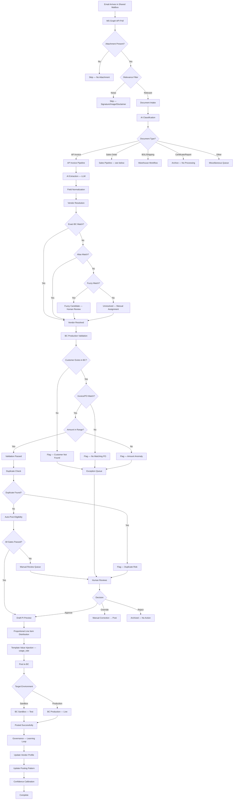
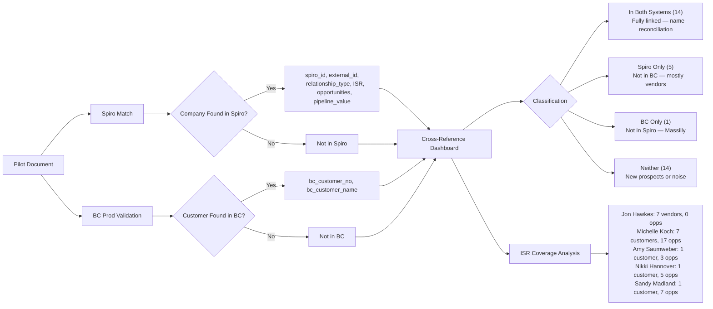

```mermaid
flowchart TD
    A[Email Arrives in ISR Mailbox] --> B[MS Graph API Poll — 7 Mailboxes]
    B --> B1["mkoch, nhannover, ASaumweber,
    jwitt, jfulton, klundquist, skuta"]
    B1 --> C{Attachment Present?}
    C -->|No| D[Skip]
    C -->|Yes| E{Relevance Filter}
    E -->|Noise — Sig/Image| F[Skip]
    E -->|Relevant| G[Document Intake]

    G --> H[AI Classification — 99% Confidence]
    H --> I[Main Learned Extraction Pipeline]
    I --> J[Field Normalization]
    J --> K[Pilot Review — PARKED]
    K --> K1["workflow_status = pilot_review
    NO BC writes, NO workflow progression"]

    K1 --> L[Auto-Enrichment Pipeline — Background]

    L --> M[Smart Reclassifier]
    M --> M1{Vendor Confirmation?}
    M1 -->|"Order Ack, _ack, Proforma"| M2[Reclassify → Vendor_Document]
    M1 -->|No| M3{Spiro Vendor?}
    M3 -->|"relationship_type = Vendor"| M2
    M3 -->|No| M4{Gamer is Customer?}
    M4 -->|Yes| M2
    M4 -->|No| M5[Keep as Sales Doc]

    M5 --> N{Certificate/Report/Noise?}
    N -->|Yes| N1[Reclassify to appropriate type]
    N -->|No| O[Genuine Customer PO]

    O --> P[Customer Resolution]
    P --> P1["extracted_fields.customer
    → vendor_canonical (skip Gamer)
    → email sender domain
    → batch parent inheritance"]

    P1 --> Q[BC Production Validation]
    Q --> Q1{Customer in BC?}
    Q1 -->|Yes| Q2[BC Customer No resolved]
    Q1 -->|No| Q3[Check Spiro CRM]

    Q3 --> Q4{Spiro Match?}
    Q4 -->|Yes| Q5["external_id = BC Customer No
    relationship_type, ISR, opportunities"]
    Q4 -->|No| Q6[No Match — New Prospect]

    Q2 --> R[SO Rules Engine — 11 Rules]
    Q5 --> R
    Q6 --> R

    R --> R1["SO-001: Customer PO attached?
    SO-002: Status governance
    SO-003: Pending Approval
    SO-004: Pending Prepayment
    SO-005: Cost on lines (Released+ only)
    SO-006: Confirmation sent
    SO-007: Pick instructions
    SO-008: Drop ship PO
    SO-009: Drop ship lines match
    SO-010: Freight coordination
    SO-011: Readiness for invoice"]

    R1 --> S{Stage Determination}
    S -->|"Draft / Open"| S1[Early Stage — Action Items Listed]
    S -->|"Pending Approval"| S2[Blocked — Credit/AR]
    S -->|"Released"| S3[Ready for Operations]
    S -->|"Not a Sales Order"| S4[Vendor Doc — Route to Purchasing]

    S1 --> T{Compliance}
    T -->|Compliant| T1["22 docs — PO + Customer + Lines present"]
    T -->|Conditionally Compliant| T2["11 docs — Some fields missing"]
    T -->|Non-Compliant| T3["3 docs — Hard blockers"]

    T1 --> U[Readiness Review — Profile Comparison]
    T2 --> U
    U --> U1{Customer Profile Found?}
    U1 -->|Yes| U2["Compare against BC Prod patterns:
    — Typical order value range
    — Known items & UOMs
    — Ship-to addresses
    — Line count patterns"]
    U1 -->|No| U3["No BC history — Manual verification"]

    U2 --> V[Sales Orders Dashboard]
    U3 --> V
    V --> V1["Status: Ready / Needs Review
    Customer: Resolved name + BC No
    SO Advisory: Profile intelligence"]

    V1 --> W[Human Review]
    W --> W1{Decision}
    W1 -->|Approve| X["Create BC Sales Order
    (Currently BLOCKED — Pilot Mode)"]
    W1 -->|Flag| Y[Flag for Correction]
    W1 -->|Reject| Z[Archive]

    M2 --> AA[Vendor Document — Excluded from SO Pipeline]
    N1 --> AA
```

# GPI Document Hub — Complete Workflow Maps
## Generated 2026-04-16 from production codebase v2.1.0

---

# 1. AP INVOICE WORKFLOW (Accounts Payable)

## Overview
Fully automated pipeline: Email → Extraction → Validation → BC Posting
Handles ~1,600+ AP docs with 92% vendor resolve, 95% validation rate

## Flow Diagram (Mermaid — paste into Lucidchart or mermaid.live)

## Key Components
| Component | File | Purpose |
|---|---|---|
| Email Polling | `services/email_polling_service.py` | MS Graph API mailbox poll |
| Classification | `server.py` — `_internal_intake_document()` | AI doc type classification |
| Extraction | `server.py` — LLM extraction | Field extraction via Emergent/Ollama |
| Normalization | `server.py` — normalize pipeline | Clean/standardize extracted fields |
| Vendor Resolution | `server.py` — vendor matching | BC cache, alias, fuzzy match |
| Validation | `server.py` — validation pipeline | BC Production cross-check |
| Draft PI Preview | `routers/posting_patterns.py` | Proportional line distribution |
| BC Posting | `routers/gpi_integration.py` | Create Purchase Invoice in BC |
| Governance | `routers/governance.py` | Dashboard + drift controls |
| Learning Loop | `services/ap_invoice_learning_*` | Profile mutation via human approval |

## Key Metrics (Production)
- Total AP Docs: 1,611
- Vendor Resolve Rate: 92.0%
- Validation Rate: 95.2%
- Auto Rate: 91.2%
- AI Confidence: 96.1%
- Posted to BC: 17 (Sandbox)

---

# 2. SALES ORDER WORKFLOW (Inside Sales Pilot)

## Overview
Ingest-only pilot: Email → Extraction → Intelligence → Human Review
NO auto-creation of BC Sales Orders (safety guardrails active)
7 ISR mailboxes, 159 docs, 57% customer match rate

## Flow Diagram (Mermaid — paste into Lucidchart or mermaid.live)

## Key Components
| Component | File | Purpose |
|---|---|---|
| Pilot Polling | `services/inside_sales_pilot_service.py` | 7-mailbox ISR polling |
| Smart Reclassifier | `services/pilot_smart_reclassifier.py` | Filter vendor docs, noise |
| BC Prod Validator | `services/bc_prod_validator.py` | Customer/Order/Item/Amount validation |
| Spiro CRM Service | `services/spiro_service.py` | OAuth2 CRM cross-reference |
| Spiro ↔ BC CrossRef | `services/spiro_bc_cross_ref_service.py` | Name reconciliation dashboard |
| SO Rules Engine | `services/so_rules_engine.py` | 11-rule compliance evaluation |
| Readiness Review | `services/pilot_readiness_review_service.py` | LLM profile comparison |
| Sales Dashboard | `routers/sales_dashboard.py` | Queue + customer resolution |
| SO Advisory Panel | `routers/explain.py` | Document detail advisory |
| Preflight/Create | `routers/gpi_integration.py` | BC Sales Order creation |
| Auto-Enrichment | `server.py` — `_run_pilot_enrichment()` | Background pipeline on intake |

## Key Metrics (Production)
- Total Pilot Docs: 159
- Mailboxes: 7
- Customer Name Hit Rate: 100%
- PO Number Hit Rate: 100%
- Total Amount Hit Rate: 49%
- BC Customer Match: 57% (vs existing pipeline 36%)
- BC Order Match: 29% (vs existing pipeline 18%)
- Profile Comparisons: 10 docs with BC Prod intelligence
- Spiro Linked: 14 companies in both systems
- Pipeline Value: $46M across 71 opportunities

## Safety Guardrails (Pilot Mode)
1. `workflow_status = pilot_review` — docs stop here
2. `auto_create_so_blocked = True` — no BC writes
3. `bc_create_ready = False` — creation button blocked
4. Spiro vendor gate — vendor docs excluded
5. Gamer-is-customer gate — wrong entity detection
6. Reclassifier — noise filtered before evaluation

---

# 3. SPIRO ↔ BC CROSS-REFERENCE

---

# 4. HOW TO IMPORT INTO LUCIDCHART

## Option A: Mermaid → Lucidchart
1. Go to https://mermaid.live
2. Paste any Mermaid code block above
3. Export as PNG or SVG
4. Import into Lucidchart as image
5. Trace over with Lucidchart shapes for editability

## Option B: Direct Build in Lucidchart
Use this document as the reference — every box, decision, and connection is mapped.
The tables show every service file and its role in the pipeline.

## Option C: Lucidchart AI
1. Copy the text workflow steps from this document
2. Use Lucidchart's "Generate diagram from text" feature
3. It will auto-create the flowchart from the structured description
